# Enjoy Trip Spring Project (이대건, 이서연)

## 프로젝트 소개

- 관광지 명소를 검색하고, 여행 플랜을 세우고 공유할 수 있는 웹 서비스
- 개발 기간 : 7일
- 개발언어 / 개발 환경 : Java / sts / Tomcat / MySQL workbench / VScode
- 필수 라이브러리 / 오픈소스 : Spring Framework(Spring Boot) / myBatis Framework/ Vue.js
- 테스트 도구 : postman / Swagger
- Spring boot version: 2.7.11
- JAVA version: 8
- mybatis-spring boot version: 2.3
- vue.js version: 2.6.14

### 시연 영상

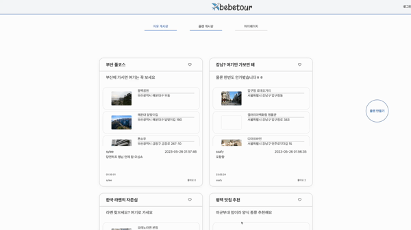

## 목차

### 1) UI 설계

| No. | 구현 기능                                     |
| --- | --------------------------------------------- |
| 1   | [나의 여행 플랜](#1-1-나의-여행-플랜)         |
| 2   | [플랜 공유 게시판](#1-2-플랜-공유-게시판)     |
| 3   | [지역별 여행지 검색](#1-3-지역별-여행지-검색) |

### 2) 구현 기능

| No. | 구현 기능                       |
| --- | ------------------------------- |
| 1   | [여행지 조회](#2-1-여행지-조회) |
| 2   | [로그인](#2-2-로그인)           |
| 3   | [공지 게시판](#2-3-공지-게시판) |
| 4   | [휴게소 조회](#2-4-휴게소-조회) |

---

## 1) UI 설계

### 1-1. 나의 여행 플랜

- 지도에서 휴게소와 여행지를 담고, 순서를 바꾸어 플랜을 등록할 수 있는 화면
  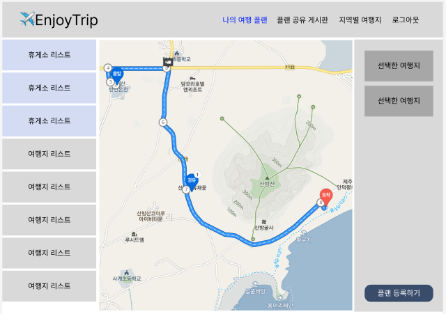

### 1-2. 플랜 공유 게시판

- 여러 사용자들이 등록한 플랜들을 확인할 수 있는 화면
  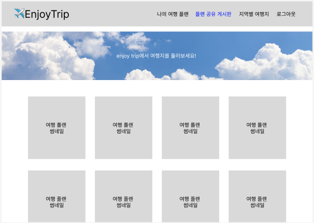

### 1-3. 지역별 여행지 검색

- 지역, 여행지 타입 및 키워드로 여행지를 검색할 수 있는 화면
  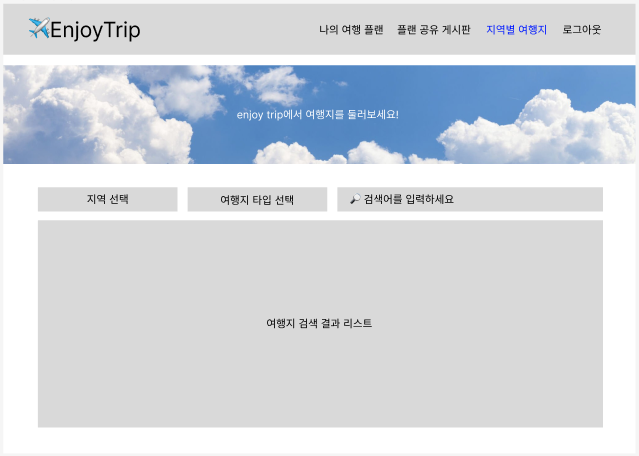

## 2) 구현 기능

---

### 2-1. 여행지 조회

- GET 방식으로 여행지 타입, 시도코드, 키워드로 검색한 여행지 리스트 요청 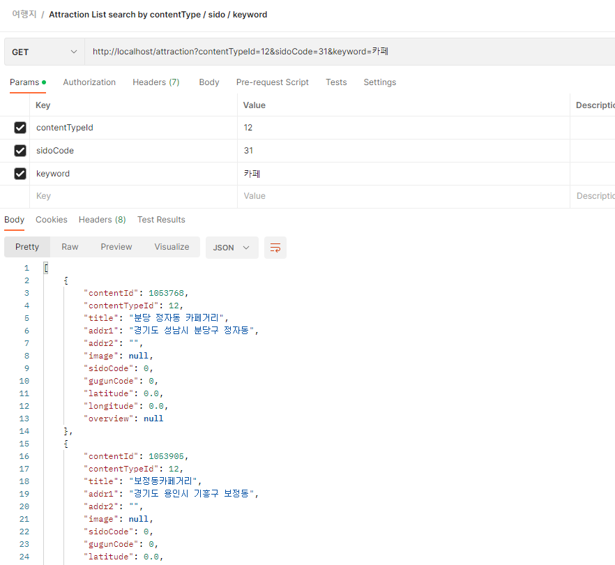

- GET 방식으로 하나의 여행지 정보 요청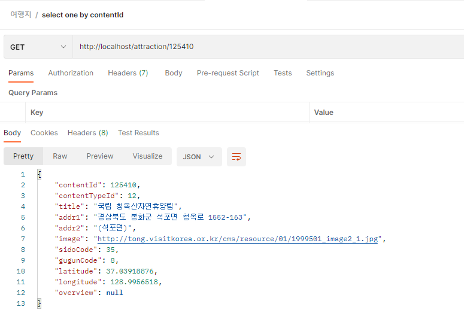

### 2-2. 로그인

- GET 방식으로 전체 회원 정보 요청 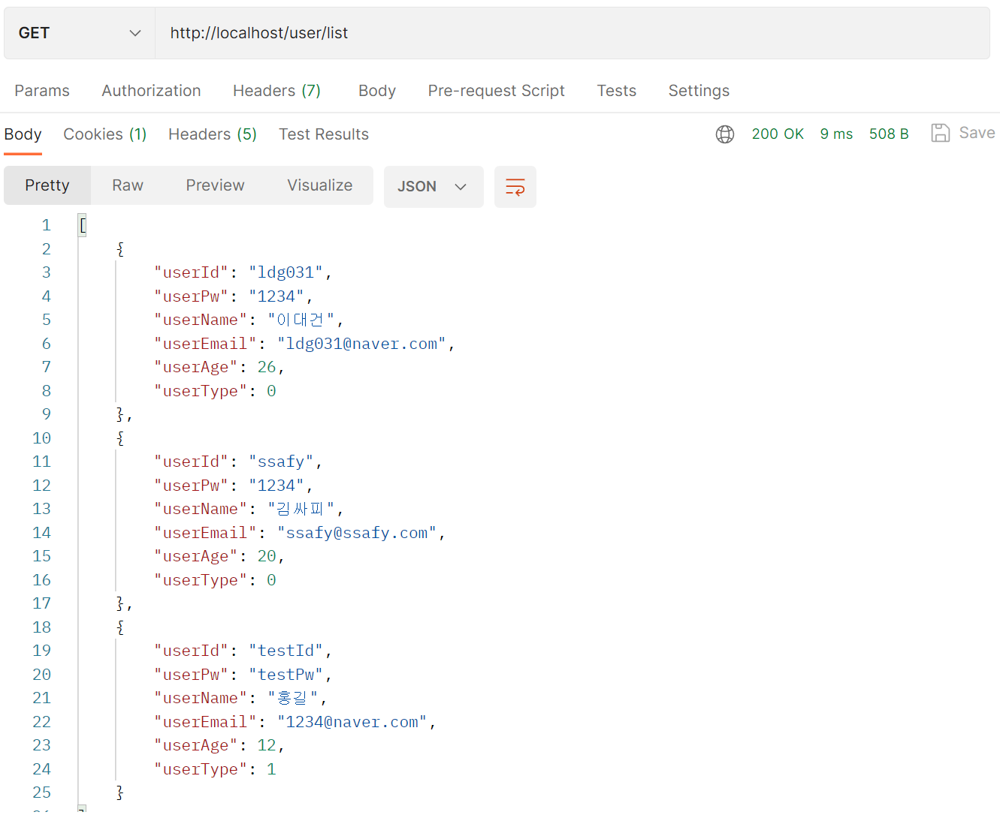

- POST 방식으로 회원가입 요청 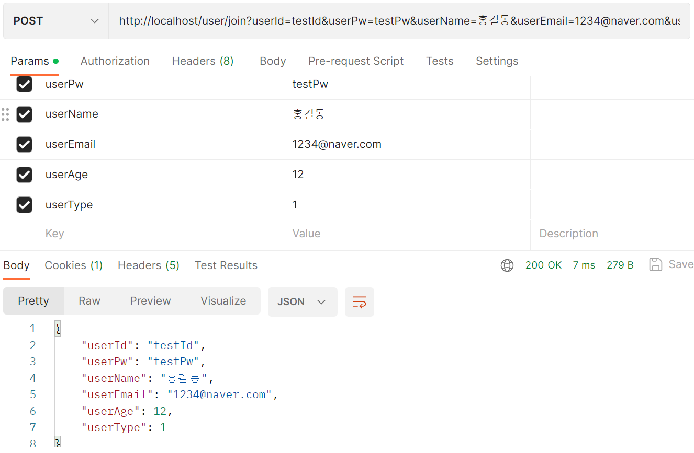

- POST 방식으로 로그인 요청 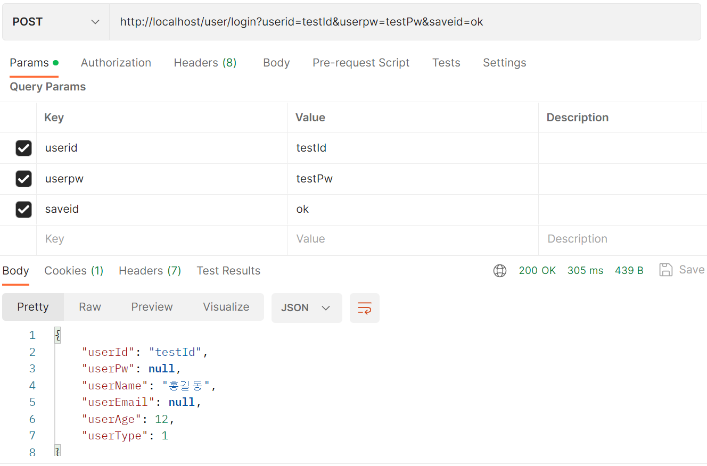

- GET 방식으로 로그아웃 요청 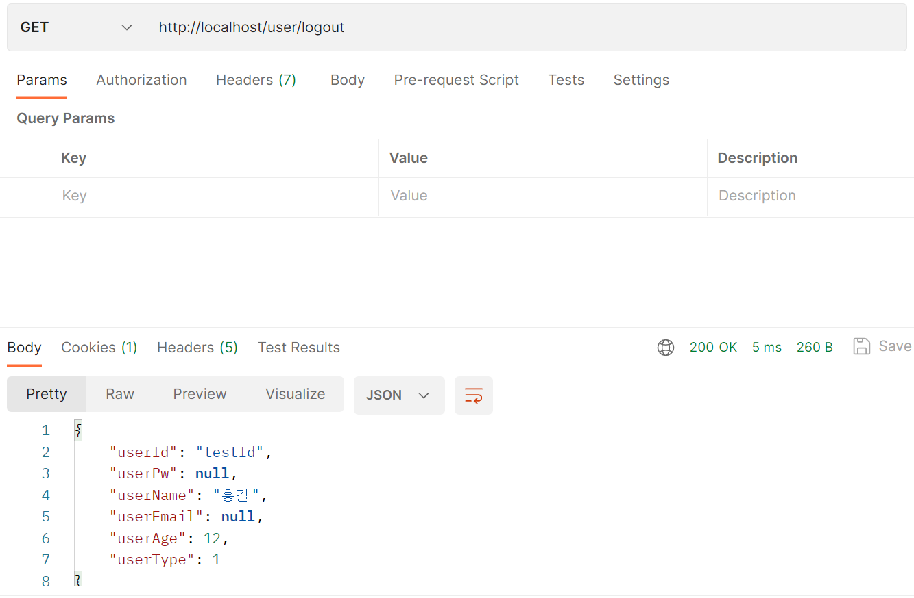

- PUT 방식으로 회원 정보 수정 요청 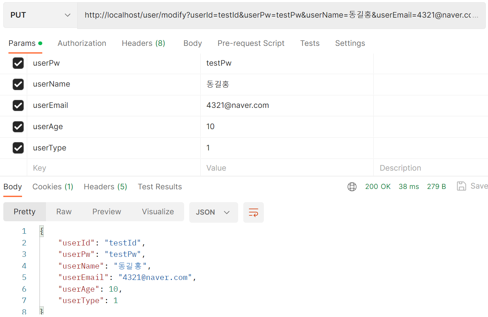

- DELETE 방식으로 회원 탈퇴 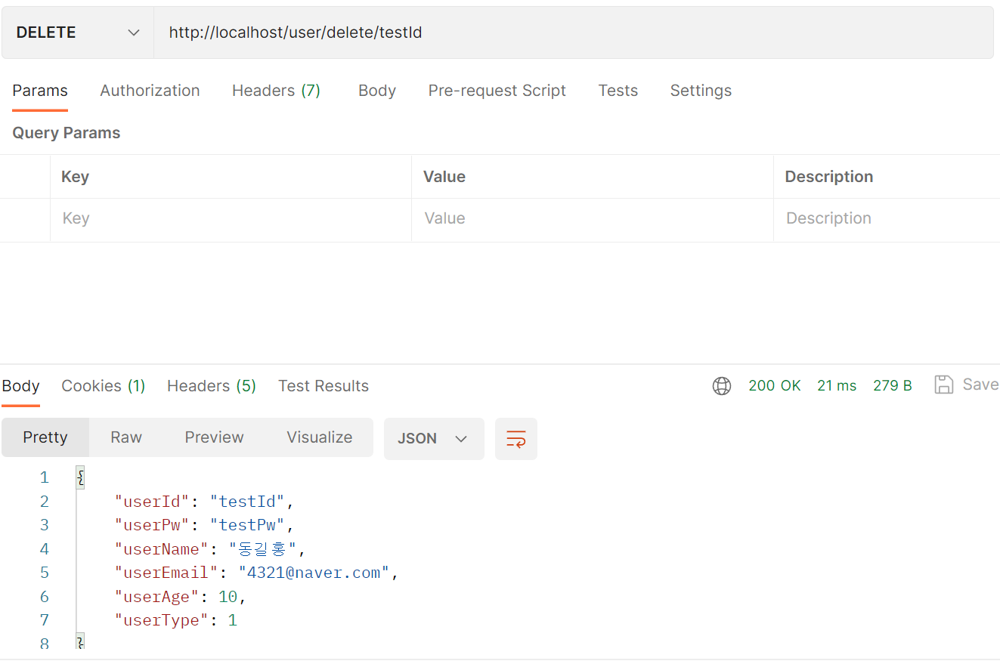

### 2-3 공지 게시판

- GET 방식으로 게시판의 모든 글 요청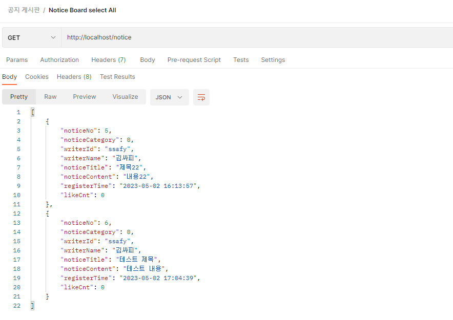

- GET 방식으로 하나의 게시글 요청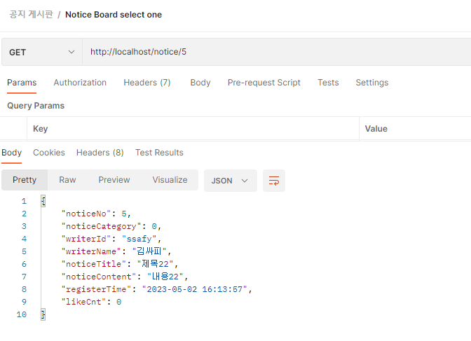

- POST 방식으로 새로운 게시글 등록 요청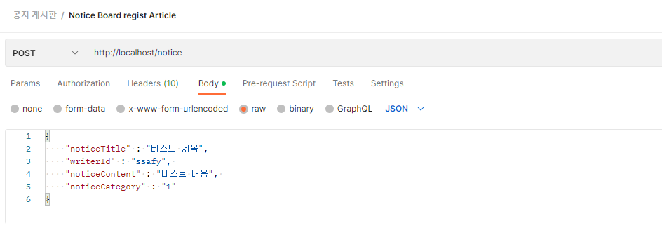

- PUT 방식으로 게시글 수정 요청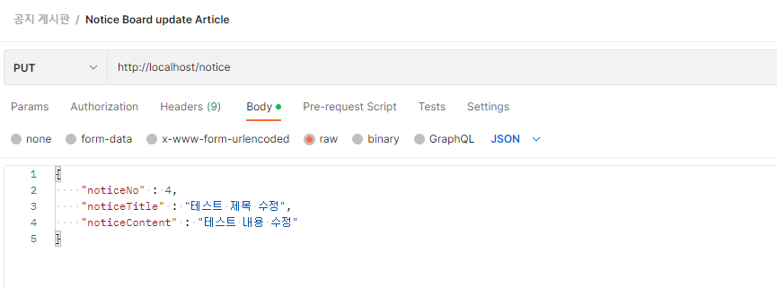

- DELETE 방식으로 게시글 삭제 요청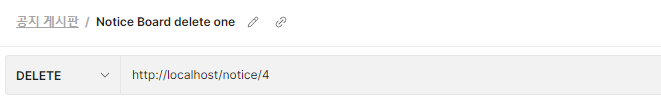

### 2-4. 휴게소 조회

- GET 방식으로 휴게소 전체 리스트 요청 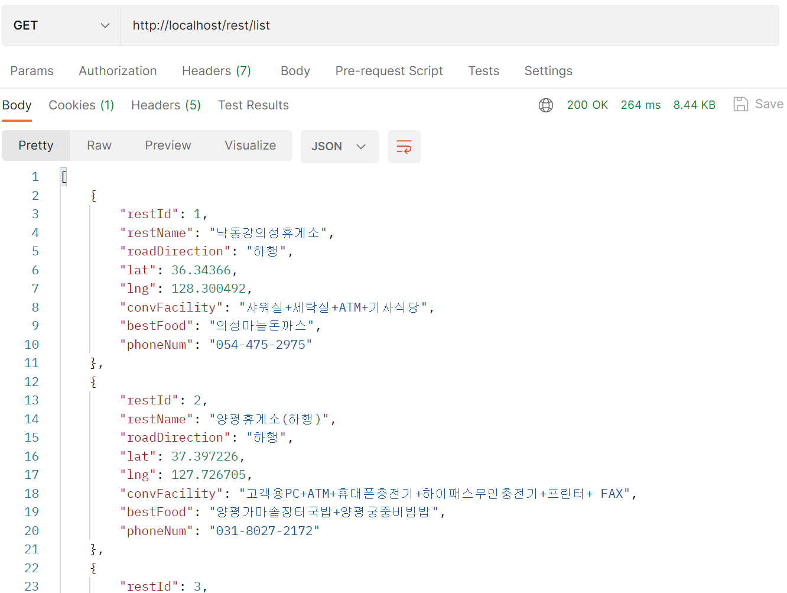

- GET 방식으로 하나의 휴게소 정보 요청 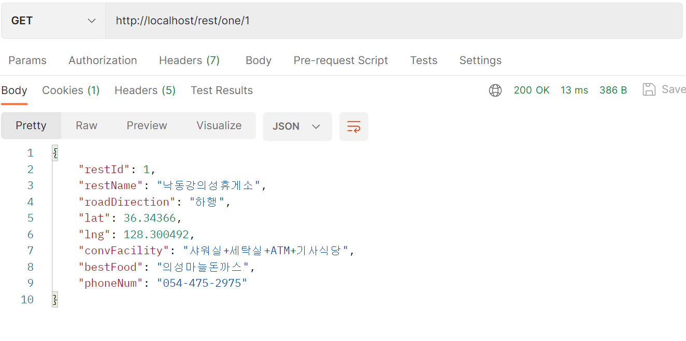
